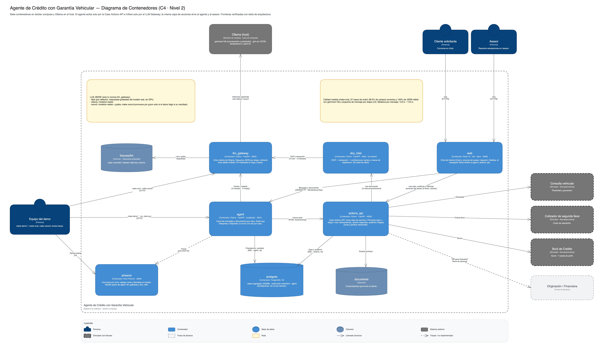

# Agente de crédito con garantía vehicular

Technical challenge (demo) para Senior AI Engineer. Un agente conversacional opera de punta a punta el
tramo pre-originación de un crédito con el auto como garantía:

**elegibilidad del auto → perfilamiento → simulación → datos y comprobantes → "OK para financiera" o
escalación a un asesor**

El LLM conversa, interpreta y extrae a JSON con esquema; **el código decide**. Las reglas son funciones
puras con una política versionada, el agente y el asesor escriben por la misma capa de acciones, y cada
acción queda en un registro que solo admite inserciones. Todo corre en local con docker compose; los
modelos (`gemma4:12b` y `glm-ocr`) corren en Ollama y, sin GPU, el demo reproduce sus respuestas grabadas.

### Resultados

| Qué | Resultado |
|---|---|
| Los 4 demos (5 guiones) | Pasan con respuestas grabadas (10 de 10 corridas) y con modelos reales (3 de 3 corridas) |
| Calidad de extracción (`make eval`, 37 casos) | **89.5%** de campos correctos (mensajes 92.0%, documentos 84.6%) y **100%** de JSON válido; umbral: 85% y 100% |
| Latencia con el modelo real | Mediana por mensaje 6.9 s (12.8 s antes de los esquemas por etapa); por documento 15.8 s |
| Pruebas | 320 de pytest, 9 de Playwright y 8 con el modelo real (`@pytest.mark.ollama`) |
| Trazabilidad | 98 de 98 requisitos (FR) con prueba marcada ([TRACEABILITY.md](TRACEABILITY.md)) |
| Reproducibilidad | Los demos sin GPU usan 140 respuestas auténticas del modelo real, 0 sembradas a mano |

## Quick start

Requisitos: Docker con Compose v2 y [uv](https://docs.astral.sh/uv/). No hace falta GPU ni Ollama para el
modo por defecto.

```bash
uv sync
make up          # construye y levanta los 7 servicios (la primera vez tarda: imágenes + Phoenix)
make demo-all    # corre los 5 guiones de los 4 demos e imprime conversación, estado final y auditoría
```

| URL | Qué es |
|---|---|
| http://localhost:8080/chat | Chat del cliente: eliges un escenario y avanzas con las sugerencias del guion |
| http://localhost:8080/asesor | Consola del asesor: escalaciones, evidencia, auditoría, acciones y métricas |
| http://localhost:6006 | Phoenix: una traza por turno del agente (proyecto `tech-challenge-agent`) |

Apagar: `make down`. Empezar de cero (borra casos, checkpoints y trazas): `docker compose down -v`.

Puertos que usa: 8080 (web), 8000 (actions_api), 8001 (agent), 8002 (llm_gateway), 8003 (doc_intel),
6006 (phoenix) y 55432 (postgres).

**Con los modelos reales** (opcional): instalar [Ollama](https://ollama.com) en el host y
`ollama pull gemma4:12b && ollama pull glm-ocr`; luego `make down && LLM_MODE=ollama make up`. En este
modo el chat entiende texto libre, no solo los mensajes del guion.

## Cómo funciona



| Servicio | Responsabilidad |
|---|---|
| `web` | React + Vite servida por nginx. Chat del cliente y consola del asesor; el navegador llama directo a `agent` y `actions_api` |
| `agent` | FastAPI + LangGraph. Canal de mensajes y documentos por caso; un turno a la vez por caso. Solo actúa por `actions_api` y solo infiere por `llm_gateway` |
| `actions_api` | Case Actions API: única capa de escritura para agente y asesor. Permisos actor × etapa × tool, idempotencia, versión esperada, auditoría. Aquí viven las reglas y la política |
| `llm_gateway` | Único cliente de Ollama. Esquema JSON por etapa, reintento ante salida inválida, PII redactada. Resuelve `LLM_MODE` |
| `doc_intel` | OCR (`glm-ocr`) → extracción (`gemma4:12b`) → confianza por campo. Sin base de datos ni estado |
| `postgres` | Esquemas `cases` (agregado JSONB), `audit` (solo inserción, con triggers) y `agent` (checkpoints); un rol por servicio |
| `phoenix` | Consola de trazas |

**Un turno, paso a paso:**

1. La web envía el mensaje a `agent` con una `Idempotency-Key`; el agente toma el candado del caso.
2. `interpret`: el gateway extrae la intención y los campos con el esquema de la etapa actual.
3. El nodo de la etapa llama tools de `actions_api` (`update_declared_data`, `evaluate_eligibility`,
   `simulate_options`…). Ahí se validan permisos, corren las reglas puras con la política del caso y se
   audita. La tool devuelve la etapa y el estado nuevos.
4. `respond`: el gateway redacta la respuesta en español a partir de hechos estructurados. La respuesta
   termina con la siguiente pregunta, que decide el código.
5. Si el cliente envía un documento, `actions_api` llama a `doc_intel` y valida (identidad, ingreso vs
   declarado, domicilio, factura, vigencia). El gate "OK para financiera" lo evalúa el sistema cada vez
   que cambia una validación; el agente no puede marcarlo.

**Principios de diseño:**

- **El LLM propone, el código decide.** Elegibilidad, perfil, cuotas, costo de la llave, validaciones y
  gate son funciones puras que reciben la política (`policy/policy.yaml`, con `policy_version`).
  Ningún cambio de etapa depende de texto generado.
- **Una sola capa de acciones.** El asesor usa las mismas tools que el agente, con actor `advisor`. Los
  rechazos también se auditan.
- **Fronteras verificadas.** El agente no toca la base del caso ni Ollama, y solo el gateway habla con
  Ollama. Los tests de arquitectura (import-linter, roles de BD, compose) fallan ante una violación.
- **Texto como dato.** El texto del cliente y de los documentos va delimitado en los prompts y no puede
  cambiar permisos, etapa ni decisiones.
- **Reproducible y medido.** Sin GPU, el demo reproduce respuestas reales grabadas, y la calidad del
  LLM se verifica con un umbral (`make eval`).

Stack: Python 3.12 (FastAPI, LangGraph, Pydantic, psycopg), PostgreSQL 16, React 19 + Vite + Tailwind,
Ollama, Arize Phoenix (OpenTelemetry + OpenInference), pytest y Playwright.

## Los 4 demos

| Demo | Comando | Qué muestra |
|---|---|---|
| 1 · Happy path | `make demo-happy-path` | Auto elegible, perfil, opciones y 4 documentos; el sistema marca **OK para financiera** |
| 2 · Rechazo por elegibilidad | `make demo-eligibility-rejection` | "Está a nombre de mi esposa": rechazo con motivo, sin consultar Buró |
| 3 · Validación documental fallida | `make demo-document-correction` · `make demo-document-escalation` | El recibo no cuadra con el ingreso declarado: la clienta corrige y llega a OK, o falla 3 veces y el caso se escala con ticket |
| 4 · Sin segunda llave | `make demo-no-spare-key` | Se cotiza la llave ($2,400), entra al plan de pagos y el caso llega a OK |

Los mismos escenarios se recorren desde el chat (`/chat`). Después del demo 3B, el asesor resuelve el
ticket desde `/asesor` o por terminal:

```bash
make advisor-open-escalations
make advisor-verify CASE=<id> KEY=income JUSTIFICATION="Ingreso confirmado por llamada con el empleador"
```

## Modelos y trazas

Una sola variable cambia el modo, y solo `llm_gateway` la conoce:

| Modo | Comando | Qué hace |
|---|---|---|
| `fake` (por defecto) | `make up` | Reproduce las respuestas grabadas de `fixtures/llm/`; sin GPU ni Ollama |
| `ollama` | `LLM_MODE=ollama make up` | `gemma4:12b` conversa y extrae, `glm-ocr` lee documentos (temperature 0, seed 42) |
| `record` | `LLM_MODE=record make up && make record` | Usa los modelos y graba; `make record` corre los demos y solo promueve las respuestas de los demos que llegaron a su resultado |

Si falta un modelo, `/health` del gateway responde 503 nombrándolo y `make up` falla; nunca cae en
silencio a respuestas grabadas. `make fixtures-status` (en `fake`) reporta si los demos usan solo
respuestas auténticas y, si no, en qué guion y paso.

En Phoenix, cada turno es una traza con raíz `turn`. Debajo van los nodos del grafo, cada tool con su
entrada y desenlace, y cada llamada al modelo con entrada, salida, latencia y tokens. Un turno de
documento incluye en la misma traza el recorrido `read_document` → OCR → extracción. Para ver un caso,
se filtra por `session.id` en la vista de sesiones. Las entradas se redactan igual que los logs, y si
Phoenix está apagado los turnos funcionan igual.

## Calidad y pruebas

```bash
make test           # unitarias e integración: reglas, tools, gateway, doc_intel y agente (necesita make up)
make test-arch      # fronteras: import-linter, permisos de BD, auditoría inmutable, compose
make test-e2e       # demos, concurrencia, reproducibilidad, métricas, trazas y respuestas auténticas
make test-web       # Playwright: los 4 escenarios del chat y la consola (Node 24; una vez: cd web && npm ci && npx playwright install chromium)
make test-ollama    # con LLM_MODE=ollama: demos y texto libre con los modelos reales, y el gate de calidad
make eval           # con LLM_MODE=ollama: ≥ 85% de campos y 100% de JSON válido sobre eval/; sale distinto de 0 si no
make traceability   # regenera TRACEABILITY.md; falla si algún FR no tiene prueba
make metrics        # rechazos por auto, falsos OK, mismatches por tipo, casos con llave cotizada
```

`make eval` mide la extracción de mensajes y documentos del set de [eval/](eval/) a través del gateway.
Usa la misma regla de puntaje con la que se compararon los modelos para elegir `gemma4:12b` y guarda
cada corrida en `eval/resultados/`. Cambiar el prompt exige subir `PROMPT_VERSION`
(`packages/contracts/src/contracts/llm.py`), regrabar y volver a pasar `make eval`.

## Dónde mirar

| Ruta | Contenido |
|---|---|
| `services/agent/src/agent/` | Grafo (`graph.py`), nodos por etapa (`nodes/`), preguntas fijas (`questions.py`), candado por turno |
| `services/actions_api/src/actions_api/` | Pipeline de tools (`toolkit.py`), permisos, tools (`tools/`), reglas puras (`rules/`), proveedores simulados |
| `services/llm_gateway/src/llm_gateway/` | Modos, prompts, esquemas por etapa, spans de las llamadas al modelo |
| `services/doc_intel/src/doc_intel/` | OCR, extracción y confianza por campo |
| `packages/contracts/` | Contratos entre servicios, llave de las respuestas grabadas y redacción de PII |
| `policy/policy.yaml` | Umbrales de negocio versionados |
| `fixtures/` | Guiones de los demos, documentos sintéticos, proveedores simulados y respuestas grabadas |
| `eval/` | Set de evaluación y corridas del gate |
| `tests/` | Arquitectura, e2e, eval y modelo real; las unitarias viven en `services/*/tests` |

**Documentación del proyecto.** Se construyó spec-driven con Spec Kit en tres features: núcleo del
agente, web de demo, y modelos reales con observabilidad. Cada una siguió spec → plan → tasks →
implement → converge.

- [specs/](specs/): spec, plan, research, modelo de datos, contratos y tareas de cada feature
  ([001](specs/001-credit-agent-core/), [002](specs/002-demo-web/), [003](specs/003-real-models-observability/)).
- [DECISIONS.md](DECISIONS.md): cada decisión con su motivo, los ajustes hechos durante la
  implementación y el historial de `make eval`.
- [TRACEABILITY.md](TRACEABILITY.md): requisito → prueba, generado a partir de los marcadores.
- [docs/diagrams/v2/](docs/diagrams/v2/): diagramas C4 de la versión entregable (contexto,
  contenedores, componentes de `agent` y `actions_api`, ciclo del caso y un turno de documento con su
  traza). La primera versión, diseñada antes de implementar, está en [v1](docs/diagrams/v1/).
- [.specify/memory/constitution.md](.specify/memory/constitution.md): principios y límites que
  gobiernan todas las features.

## Alcance y limitaciones

- **Fuera de alcance:** originación (el caso queda en "OK para financiera"), canal real (WhatsApp),
  autenticación y roles, colas, Kubernetes y CI/CD.
- **Proveedores simulados:** Buró, consulta vehicular y cotizador de llave responden desde fixtures YAML
  detrás de adaptadores. Sustituirlos por los reales no toca las reglas.
- **Texto libre:** con respuestas grabadas solo se entienden los mensajes del guion; el texto libre
  requiere `LLM_MODE=ollama`.
- **Extracción de documentos:** por sí sola queda en 84.6% de campos; el umbral de 85% se cumple sobre
  el set completo. Es el punto más claro de mejora.
- **Esquemas por etapa:** un dato que el cliente adelanta fuera de su etapa no se extrae en ese turno;
  el agente lo pide en su etapa. Es una decisión que bajó la latencia a la mitad (`DECISIONS.md`, O-13).
- **Modo real:** en la laptop de desarrollo, un guion completo con modelos reales tarda de 40 segundos (el
  rechazo) a 6 minutos (los de documentos).
- **Error conocido:** si `actions_api` no responde al crear un caso (`POST /cases`), el agente devuelve
  500 en lugar de un error claro. Los turnos ya manejan ese caso.

## Datos y problemas comunes

Todo es sintético: los documentos llevan la marca "ESPÉCIMEN DE PRUEBA — DATOS FICTICIOS"
([fixtures/documents/](fixtures/documents/), generados con `scripts/make_documents.py`). No hay datos
reales ni secretos; [.env.example](.env.example) solo trae los valores locales del compose.

- **`make up` falla por un puerto ocupado:** libera los puertos de la lista del Quick start.
- **`make up` falla con `LLM_MODE=ollama`:** `curl localhost:8002/health` dice qué modelo falta;
  `ollama pull <modelo>`.
- **Un turno responde "un servicio tardó demasiado o no respondió":** con modelos reales, Ollama puede
  tardar en cargar el modelo la primera vez; reintentar.
- **No aparecen las trazas de inmediato:** Phoenix ingiere por lotes; después de muchas pruebas seguidas
  puede tardar cerca de un minuto.
