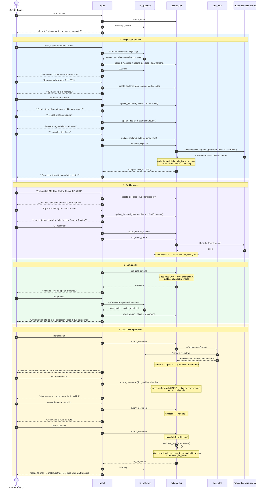

# Demo 1 · Happy path

`make demo-happy-path` · guion `fixtures/scenarios/happy_path.yaml`

Laura tiene un auto a su nombre, sin adeudos y con las dos llaves. Pasa el perfilamiento, elige la primera opción y
envía los 4 documentos en orden. El sistema marca el caso **OK para financiera**. Los turnos abreviados siguen el
[patrón de un turno](README.md#patrón-de-un-turno-de-mensaje).

**Resultado:** status `ok_for_lender`. El "OK para financiera" lo marca el sistema (`evaluate_gate`, actor `system`),
no el agente.
