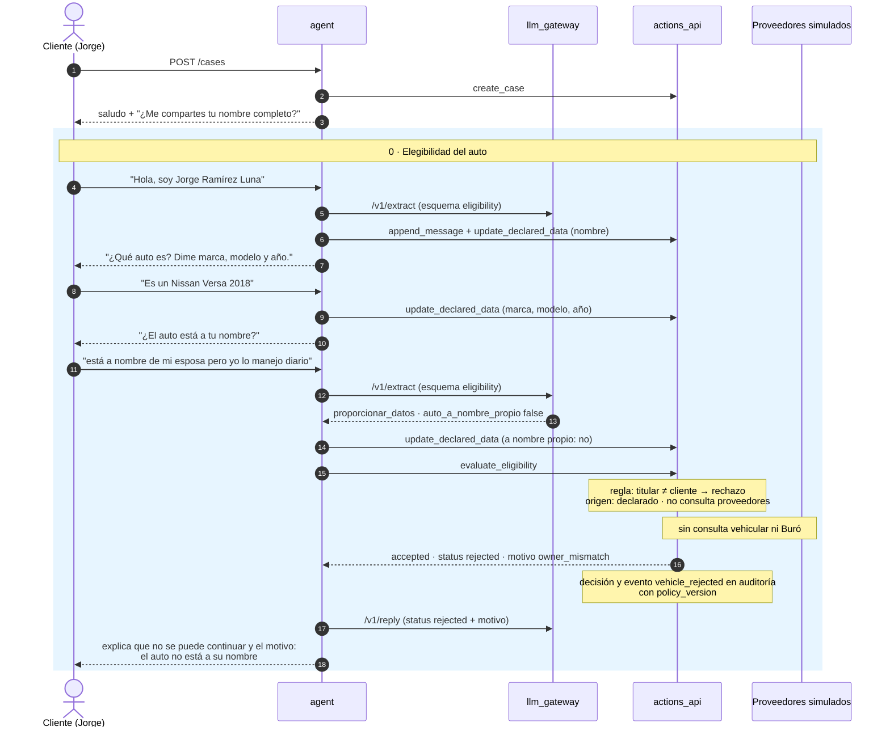

# Demo 2 · Rechazo por elegibilidad

`make demo-eligibility-rejection` · guion `fixtures/scenarios/eligibility_rejection.yaml`

Jorge declara que el auto está a nombre de su esposa ("yo lo manejo diario" es un distractor: manejarlo no es ser
titular). La regla rechaza por lo declarado, sin consultar al proveedor vehicular ni al Buró, y el rechazo queda
auditado con su motivo.

**Resultado:** status `rejected` en la etapa de elegibilidad. El agente no puede revertirlo: no hay tool que le
permita reabrir un caso rechazado.
