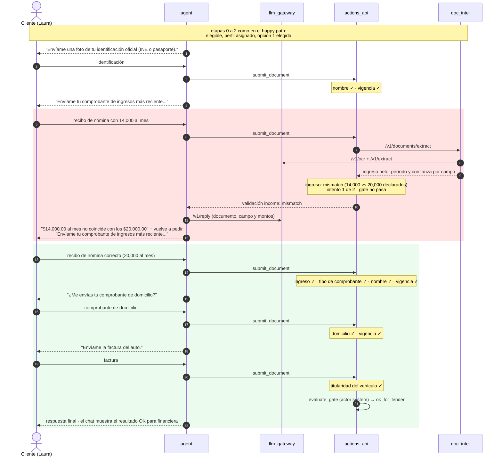
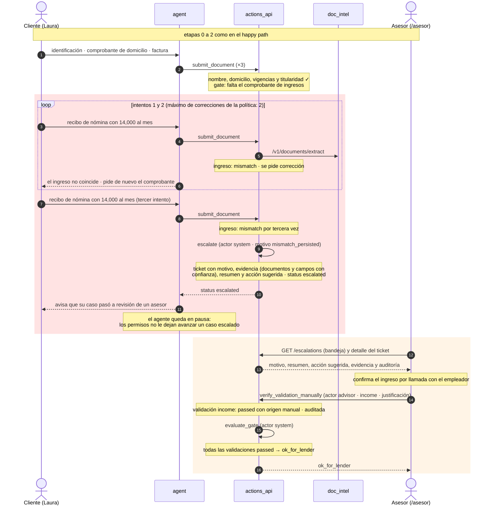

# Demo 3 · Validación documental fallida

Laura declaró un ingreso de 20,000 al mes, pero el primer recibo de nómina muestra 14,000. La validación de ingreso
(±10%, mismo período y moneda) falla y el caso no puede llegar a OK. Las etapas 0 a 2 son iguales a las del
[happy path](1-happy-path.md) y aquí se resumen.

## 3A · Corrección: la clienta envía el recibo correcto

`make demo-document-correction` · guion `fixtures/scenarios/document_correction.yaml`

**Resultado:** status `ok_for_lender`. La validación de ingreso queda auditada dos veces: primero como mismatch y
después como aprobada con el documento nuevo.

## 3B · Escalación: el recibo no cuadra tres veces y un asesor resuelve

`make demo-document-escalation` · guion `fixtures/scenarios/document_escalation.yaml` · resolución:
`make advisor-verify CASE=<id> KEY=income JUSTIFICATION="..."` o la consola `/asesor`

**Resultado:** status `escalated` y, después de la acción del asesor, `ok_for_lender`. El asesor actúa con las mismas
tools que el agente y el gate lo vuelve a evaluar el sistema. El asesor también podría pedir corrección
(`request_correction`), rechazar (`reject_case`) o regresar el caso al agente (`return_to_agent`).
