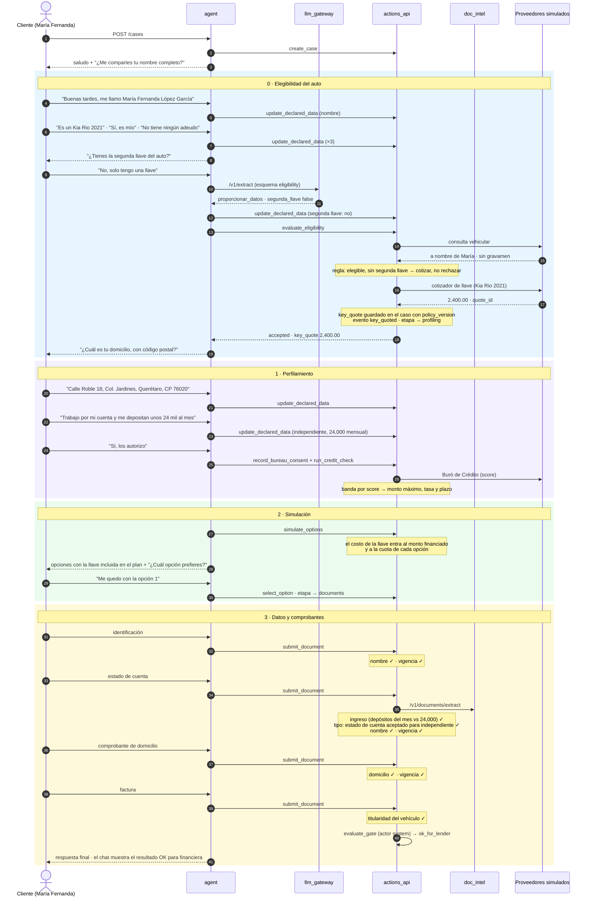

# Demo 4 · Sin segunda llave

`make demo-no-spare-key` · guion `fixtures/scenarios/no_spare_key.yaml`

María Fernanda tiene una sola llave. No es un rechazo: `evaluate_eligibility` cotiza la reposición con el proveedor
de llaves ($2,400 para un Kia Rio 2021) y ese costo entra al plan de pagos de la simulación. Es independiente, así
que su comprobante de ingresos es un estado de cuenta.

**Resultado:** status `ok_for_lender`, con la cotización de la llave en el caso y en el plan de pagos. El caso cuenta
en la métrica "casos con llave cotizada".
