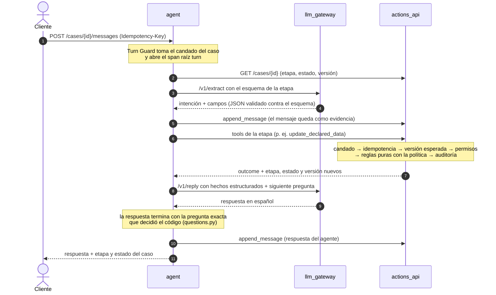
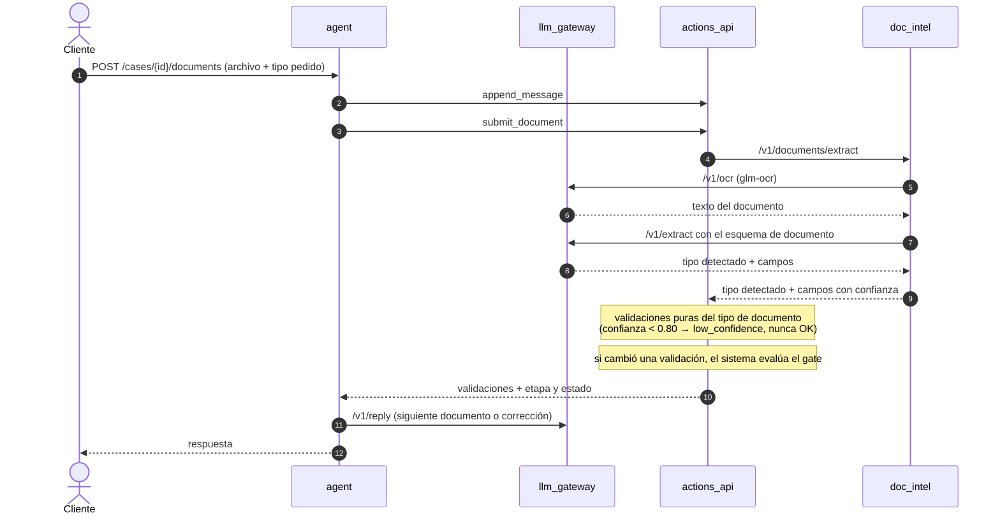

# Diagramas de secuencia de los 4 demos

Cada diagrama sigue lo que ejecuta el guion del demo (`fixtures/scenarios/*.yaml`) y las acciones que quedan en el
registro de auditoría al correrlo (`make demo-*`). Los textos entre comillas son los mensajes del guion.

| Demo | Diagrama | Comando |
|---|---|---|
| 1 · Happy path | [1-happy-path.md](1-happy-path.md) | `make demo-happy-path` |
| 2 · Rechazo por elegibilidad | [2-eligibility-rejection.md](2-eligibility-rejection.md) | `make demo-eligibility-rejection` |
| 3 · Validación documental fallida (A: corrección · B: escalación y asesor) | [3-document-validation.md](3-document-validation.md) | `make demo-document-correction` · `make demo-document-escalation` |
| 4 · Sin segunda llave | [4-no-spare-key.md](4-no-spare-key.md) | `make demo-no-spare-key` |

Participantes: el **cliente** (chat `/chat` o el guion), **agent**, **llm_gateway**, **actions_api** (Case Actions
API), **doc_intel** y los **proveedores simulados** con fixtures (consulta vehicular, cotizador de llave, Buró). Con
`LLM_MODE=fake` el gateway responde con respuestas grabadas del modelo real; con `LLM_MODE=ollama` llama a
`gemma4:12b` y `glm-ocr`. El flujo es el mismo en ambos modos.

Para que los demos se lean, cada diagrama detalla el primer turno y abrevia los siguientes. Todos siguen uno de
estos dos patrones.

## Patrón de un turno de mensaje

## Patrón de un turno de documento

Validaciones por tipo de documento: identificación → nombre y vigencia · comprobante de ingresos → ingreso vs
declarado (±10%, mismo período y moneda), tipo de comprobante aceptado según la situación laboral, nombre y vigencia
· comprobante de domicilio → domicilio y vigencia · factura → titularidad del vehículo.
